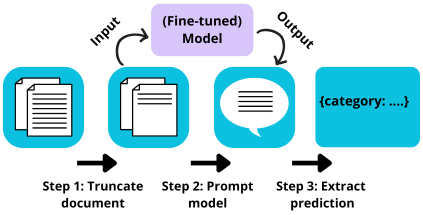

# Document Classification using Large Language Models

This repo is for code related to the project Document Classification under the Woo (Open Government Act). The goal of this research is to find an effective method to classify documents that the Municipality of Amsterdam publishes. 
We evaluate three LLMs for this task: Llama, Mistral and GEITje. 




The research consists of four main parts:
1. Truncation experiment. The documents are too long to give as input to the models, thus a truncation experiment is run to find the best truncation threshold to shorten the documents.
2. In-context learning experiment. To evaluate how well the LLMs perform this task in their current state an in-context learning experiment is performed. We compare the performance of a zero-shot prompt to that of a few-shot prompt.
3. Fine-tuning experiment. We compare the results of the in-context learning to that of the LLMs after they have been fine-tuned on the task.
4. Baselines experiment. To evaluate the worthwhile of the LLMs, we compare them to simple baselines, such as Naïve Bayes and Linear SVM.


## Overleaf Link
[Thesis Design](https://www.overleaf.com/2549441224szvvffnxqsdk#eda3e6)


[Thesis](https://www.overleaf.com/8368827141bwgxbjwcfgfv#3d9efc)

<!-- ## Background
I dont think this section is necessary? What would I put here? -->

## Folder Structure
* [`notebooks`](./notebooks): Jupyter notebooks / tutorials
* [`PredictionAnalysis`](./PredictionAnalysis): Only jupyter notebooks about prediction analysis 
<!-- * [`scripts`](./scripts): Scripts for automating tasks -> RENAME INTO SRC? -->
* [`src`](./src): All sourcecode files specific to this project 
* [`output`](./output) Folder to save data and predictions. Same structure as the Blobfuse folder.

<!-- I put remove after folder that I don't think I'll need. 
* [`data`](./data): Sample data for demo purposes -> REMOVE?
* [`docs`](./docs): If main [README.md](./README.md) is not enough -> REMOVE?
* [`res`](./res): Relevant resources, e.g. [`images`](./res/images/) for the documentation -> REMOVE?
* [`tests`](./tests) Unit tests -> REMOVE?
* [`res`](./res): Relevant resources, e.g. [`images`](./res/images/) for the documentation -> REMOVE? -->


## Installation 

1) Clone this repository:


```bash
git clone https://github.com/AmsterdamInternships/document-classification-using-large-language-models.git
```


2) Install all dependencies:
    
Right now, im having trouble with setting up the requirements.txt files. I will get to that later, for now, the most important libraries to install to get the fine-tuning to work are:

```bash
pip install torch
pip install datasets
pip install transformers
pip install trl
pip install accelerate 
pip install sentencepiece
pip install jupyter
pip install protobuf 
pip install bitsandbytes
pip install bnb
pip install wandb==0.13.3 --upgrade
pip install tensorboardX
```


```bash
pip install -r requirements.txt
```

The code has been tested with Python 3.9 on Windows. 

<!-- ## Usage
What do I need to put here? -->
## How it works
All code can be run in the notebooks. They have been numbered in the right order of usage.
* [`0FileOverview`](./notebooks/0FileOverview.ipynb) -> An overview of all the data files and their columns explained. Does not include code. 
* [`1load_txt`](./notebooks/1load_txt.ipynb) -> Loads the text from the OCR files.
* [`2clean_data`](./notebooks/2clean_data.ipynb) -> Removes messy documents and duplicates. Splits data into subsets.
* [`3TokenizeText`](./notebooks/3TokenizeText.ipynb) -> Tokenize the documents using either the Mistral or the Llama tokenizer. 
* [`4FinetuningDataFormatting`](./notebooks/4FinetuningDataFormatting.ipynb) -> Format the data frame with documents into a dataset that is pushed to HuggingFace. 
* [`5Finetuning`](./notebooks/5Finetuning.ipynb) -> Finetune the LLMs on the dataset on HuggingFace.
* [`6GetPredictions`](./notebooks/6GetPredictions.ipynb) -> Run the experiments for the LLMs (IC and FT).
* [`7baseline`](./notebooks/7baseline.ipynb) -> Train the baselines and run the experiments. 
* [`8plot`](./notebooks/8plot.ipynb) -> Notebook with plots. 


Stand-alone notebooks:
- EDA/EDA_clean_for_submission
- [`RepairMistralPredictions`](./notebooks/RepairMistralPredictions.ipynb) -> Repair mistakes made by mistral. Exceptional to Mistral. 
<!-- - data_insight -> still messy. use it now to get some quick results for either overleaf or to check something in the data. -->
<!-- 
## TODO:
- clean up finetuning overview_model file
- fix requirements file
- Make EDA runnable
- local paths: Create outputfile with 10 docs per class (demo data). Check hardcoding for split function. Check if all code is runnable on this demo function. Only different thing in code should be replacement of configure file.

Can be divided in subsections:

### input
### algorithm
### output

OR

### training
### prediction
### evaluation -->

## Contributing


Feel free to help out! [Open an issue](https://github.com/AmsterdamInternships/document-classification-using-large-language-models/issues), submit a [PR](https://github.com/AmsterdamInternships/document-classification-using-large-language-models/pulls)  or [contact us](https://amsterdamintelligence.com/contact/).


## Acknowledgements


This repository was created in collaboration with [Amsterdam Intelligence](https://amsterdamintelligence.com/) for the City of Amsterdam.


Optional: add citation or references here.


## License 

This project is licensed under the terms of the European Union Public License 1.2 (EUPL-1.2).
